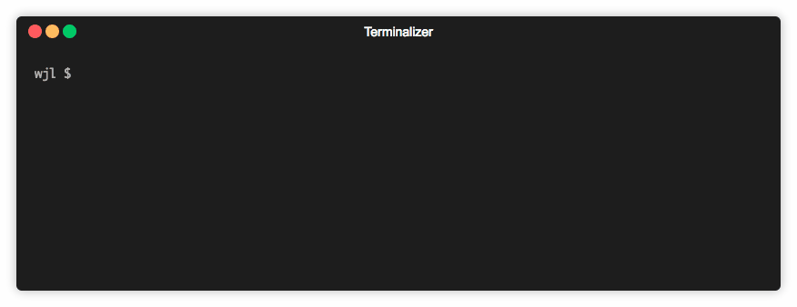

## Instructions

To build:

```
$ ghc -o lambda-repl ./Lambda/Main.hs
```

then

```
$ ./lambda-repl

λ-repl
:q to quit

> \x -> x
\x -> x

> (\p q -> p q) q
\q' -> q q'
```

Or, to run without building:

```
$ runhaskell ./Lambda/Main.hs

λ-repl
:q to quit

>
```

## Features

At the moment, all reduction is done using the *normal-order* strategy, although I hope to add other options in the future.
Evidence of normal-order reduction can be seen in the reduction of `(\x -> z) ((\x -> x x) \x -> x x)` to `z`.

Bound variables are changed by adding primes to their name in situations where free variables would otherwise be captured.
Thus, `(\x y -> x) y` reduces to `\y' -> y`.
Otherwise, variable names are unchanged throughout the reduction.